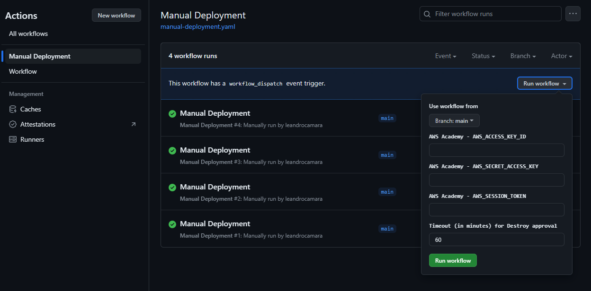

# fiap.tech-challenge.fast-food.infra.cognito

Este repositório é responsável por manter a infraestrutura do Cognito da aplicação [**_Fast Food API_**](https://github.com/leandrocamara/fiap.tech-challenge.fast-food.api).

A infraestrutura é mantida com o [**_Terraform_**](https://www.terraform.io/) e provisionada na _AWS_.

## Execução

Após a execução dos [_Workflows_](https://github.com/leandrocamara/fiap.tech-challenge.fast-food.infra.k8s/actions) (GitHub Actions), uma pool de usuarios _user pool_ [**_Cognito_**](https://docs.aws.amazon.com/cognito/) é provisionado na _AWS_.

Há duas maneiras de executar e criar o _user pools_:

1. Realizando um `push` na `main`, por meio de um `Merge Pull Request`;

2. Executando o [_Manual Deployment_](https://github.com/mpatricio007/fiap.tech-challenge.fast-food.infra.cognito/actions/workflows/manual-deployment.yaml) (_Workflow_)

    

    2.1. Por padrão, o _Workflow_ utilizará as `Secrets` configuradas no projeto. Caso esteja utilizando o `AWS Academy`, recomenda-se informar as credencias da conta. **Obs.:** Cada sessão do _AWS Academy_ dura **4 horas**.

Independentemente do caminho escolhido, ao final do **_CD_** (após a execução do `$ terraform apply`), é criado uma [**_Issue_**](https://github.com/mpatricio007/fiap.tech-challenge.fast-food.infra.cognito/issues), que aguarda por uma aprovação, para **destruir** a infraestrutura criada. Esta etapa é útil para evitar gastos desnecessários na conta da _AWS (Academy)_.

**Obs.:** Por padrão, o tempo aguardado é de **60 minutos**. Apenas os colaboradores do repositório possuem permissão para aprovação.

## Tech Challenge
Projeto para a curso de [Pós Graduação FIAP - Software Architecture](https://postech.fiap.com.br/curso/software-architecture/).

O grupo (19) é composto por:
- [Danilo Queiroz da Silva](https://github.com/DaniloQueirozSilva)
- [Elton Douglas Souza](https://github.com/eltonds88)
- [Leandro da Silva Câmara](https://github.com/leandrocamara)
- [Marcelo Patricio da Silva](https://github.com/mpatricio007)
